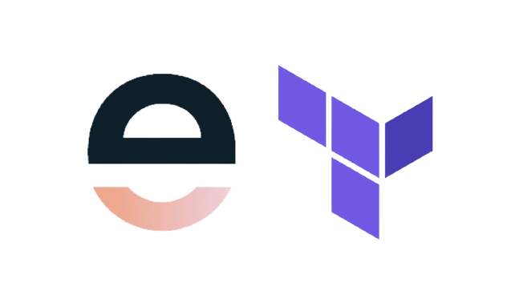

<div align="center">


<h1>Entitle Terraform Provider</h1>
<h5>In Development</h5>
</div>

The Terraform Provider for Entitle allows you to manage resources and data sources related to Entitle, a platform that provides a seamless way to grant employees granular and just-in-time access within cloud infrastructures and SaaS applications.

### Supported Resources
* **Workflow** - A workflow in Entitle is a generic description of Just-In-Time permissions approval process, which is triggered after the permissions were requested by a user. Who should approve by approval order, to whom, and for how long. After the workflow is defined, it can be assigned to multiple entities which are part of the Just-In-Time permissions approval process: integrations, resources, roles and bundles.
* **Integration** -A specific instance or integration with an "Application". Integration includes the configuration needed to connect Entitle including credentials, as well as all the users permissions information.
* **Bundle** - Entitle bundle is a set of entitlements that can be requested, approved, or revoked by users in a single action, and set in a policy by the admin. Each entitlement can provide the user with access to a resource, which can be as fine-grained as a MongoDB table for example, usually by the use of a “Role”. Thus, one can think of a bundle as a cross-application super role.
* **Policy** -  Entitle policy is a rule which manages users birthright permissions automatically, a group of users is entitled to a set of permissions. When a user joins the group, e.g. upon joining the organization, he will be granted with the permissions defined for the group automatically, and upon leaving the group, e.g. leaving the organization, the permissions will be revoked automatically.
* **Agent Token** - On-prem agent token.
* **Resource** - An entity within an "Integration" to which a user can gain access via an "Entitlement", e.g. DB table, group of users.

## Prerequisites

Before using the Entitle Terraform Provider, ensure you have the following:

### Provider Configuration
Configure the Entitle Terraform Provider with your API key and endpoint:

* `api_key` (Required): The API key for authenticating with the Entitle API.
* `endpoint` (Optional): The URL endpoint for the Entitle API. default: https://api.entitle.io.

To use the Entitle Terraform Provider, you must configure it with the necessary authentication details.

```hcl
provider "entitle" {
  api_key = "your_api_key"
  endpoint = "https://api.entitle.io"
}
```

## Developing the Provider

If you wish to work on the provider, you'll first need [Go](http://www.golang.org) installed on your machine 
(see [Requirements](#requirements) below).

## Requirements

- [Terraform](https://developer.hashicorp.com/terraform/downloads) >= 1.0
- [Go](https://golang.org/doc/install) >= 1.24.3

## Building The Provider

1. Clone the repository
1. Enter the repository directory
1. Build the provider using the Go `install` command:


To compile the provider, run `go install`. This will build the provider and put the provider binary in 
the `$GOPATH/bin` directory.

before starting you need to overide the configuration for the terraform provider to be search first of all localy in
`$GOPATH/bin`

```hcl
provider_installation {

  dev_overrides {
      "entitleio/entitle" = `$GOPATH/bin`
  }

  # For all other providers, install them directly from their origin provider
  # registries as normal. If you omit this, Terraform will _only_ use
  # the dev_overrides block, and so no other providers will be available.
  direct {}
}
```

To generate or update documentation, run `go generate`.

In order to run the full suite of Acceptance tests, run `make testacc`.

*Note:* Acceptance tests create real resources, and often cost money to run.

```shell
make testacc
```

## License Compliance

This project is licensed under the Mozilla Public License 2.0 (MPL-2.0). All dependencies have been scanned and verified to be compatible with MPL-2.0.

To run a license compliance scan:

```shell
./scripts/license-scan.sh
```

For detailed license analysis, see [LICENCE_ANALYSIS.md](./LICENCE_ANALYSIS.md).
